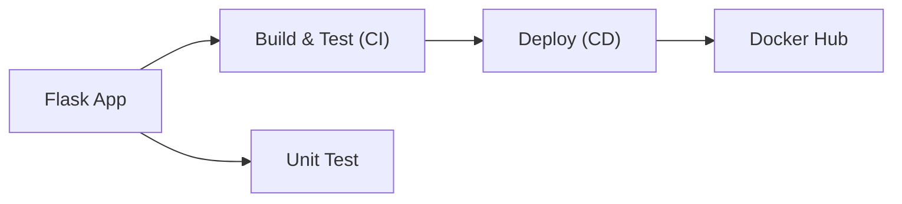
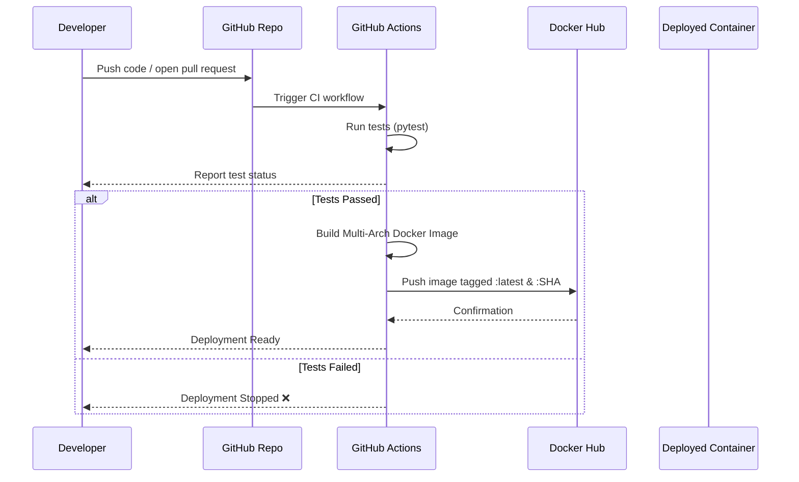

# Flask CI/CD Pipeline with GitHub Actions & Docker

This project demonstrates a complete **CI/CD pipeline** for a containerized Flask application using:

- **Python + Flask**
- **GitHub Actions**
- **Docker Buildx**
- **Multi-arch container builds (`amd64` + `arm64`)**
- **Automatic Docker Hub publishing**
- **Unit testing before deployment**

The goal is to provide a real-world, minimal, extensible template for production-style continuous integration and deployment.

---

## 📁 Project Structure

```
project-root/
│
├── src/
│   └── app.py            # Flask application
│
├── requirements.txt      # Python dependencies
├── Dockerfile            # Container image
└── .github/workflows/
    └── ci-cd.yml         # CI/CD pipeline
```

---

## 🚀 Running the Application Locally

### 1️⃣ Create a virtual environment (optional)
```bash
python3 -m venv venv
source venv/bin/activate   # Windows: venv\Scriptsctivate
```

### 2️⃣ Install dependencies
```bash
pip install -r requirements.txt
```

### 3️⃣ Run Flask app
```bash
export FLASK_APP=src/app.py
flask run --host=0.0.0.0 --port=5000
```

Visit → http://localhost:5000  

---

## 🧪 Running Tests

```bash
pytest
```

---

## 🐳 Running the App with Docker

### Build the image
```bash
docker build -t flask-ci-cd-app -f DockerFile .
```

### Run the container
```bash
docker run -p 5000:5000 flask-ci-cd-app
```

Access the app:
➡ http://localhost:5000

---

## 🔁 CI/CD Pipeline Explanation

### The pipeline performs:

| Stage | Action |
|-------|--------|
| **CI - Testing** | Runs unit tests on every push/PR |
| **Build (Docker)** | Builds multi-arch Docker image |
| **CD - Deployment** | Pushes image to Docker Hub only if tests pass |
| **Tagging** | Tags as `latest` and with Git SHA |

---

## 🧭 System Architecture



---

## 🔄 CI/CD Process



---

## 🔐 Secrets Configuration for Deployment

Add the following **Repository → Settings → Secrets → Actions**:

| Secret | Value |
|--------|-------|
| `DOCKER_USERNAME` | Your Docker Hub username |
| `DOCKER_PASSWORD` | Docker Hub access token |

---

## 🔧 CI Pipeline Trigger Points

The pipeline automatically runs on:

- `push` to `main`
- Pull requests targeting `main`

To manually trigger builds via tag or branch, modify `.github/workflows/ci-cd.yml`.

---

## 💡 Why Multi-Architecture?

Modern developers use:

- Intel machines (`amd64`)
- M1/M2/M3 MacBooks (`arm64/v8`)
- Cloud providers running mixed CPU types

Building multi-arch ensures **your container runs anywhere.**

---

## 📌 Future Enhancements (If you want to extend)

- ⬆ Add staging vs production deployments  
- 🧪 Add coverage & code linting (flake8 / ruff)  
- ⚙ Deploy to AWS ECS / Azure Web App / Railway / GCP Cloud Run  
- 🛡 Database integration and migrations  

---

## ⭐ Support

If you like this project, consider ⭐ starring the repo to help others discover it!
